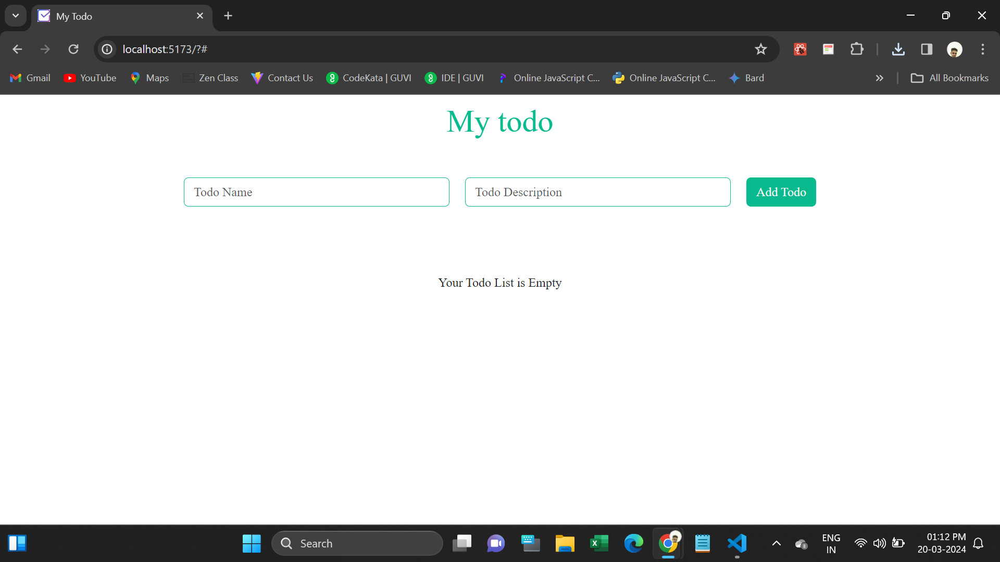
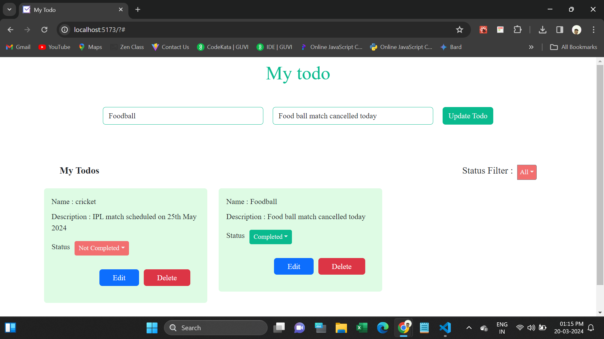

# React Todo Task

This webpage is used to creating Todo Lists.

It have filter, status change, update, delete functionalities with dynamically.

Its fully Responsive.

  <h4>Used Tools</h4>
<ul>
  <li>Html</li>
  <li>CSS</li>
  <li>Bootstrap</li>
  <li>Javascript</li>
  <li>React JS</li>
</ul>
<h4>Npm Packages are used:</h4>
<ul>
  <li>https://www.npmjs.com/package/bootstrap</li>
  <li>https://www.npmjs.com/package/@fontsource/poppins</li>
</ul>
<h3>Deployed URL</h3>

<h5>Screenshots</h5>
1.Todo Home

2.Added Todo

3.Updating Todo

